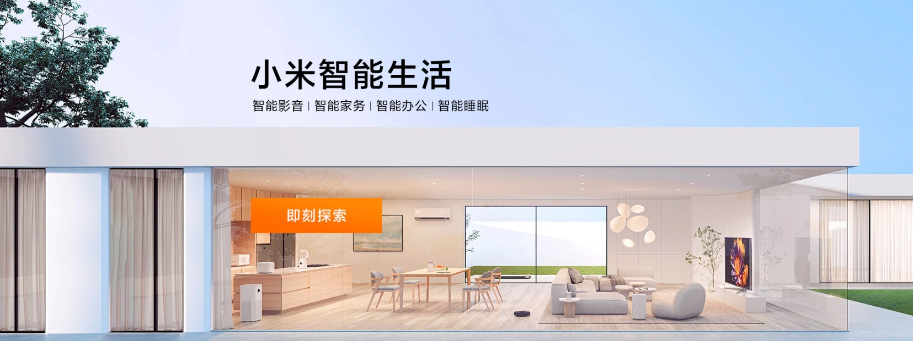

# 轮播图

> ==效果展示：==
>
> 
>
> 如图所示，轮播图可以自动滚动。当鼠标悬停在轮播图上则停止轮播图滚动，鼠标离开继续滚动。点击两侧按钮或下方小圆圈则切换图片。
>
> ==思路：==
>
> 1. 为轮播图模块绑定鼠标事件，鼠标经过显示左右按钮，离开隐藏；点击右侧按钮一次图片往左播放一张，左侧同理。
> 2. 利用 `for` 循环动态生成小圆圈，小圆圈的个数与图片张数一致；创建节点 `createElement('li')` ，再用 `appendChildren` 插入到 `ol` 中。
> 3. 小圆圈样式则利用排他思想，触发点击事件的小圆圈才设置样式。注意：我们在生成小圆圈的同时就可直接绑定点击事件了。
> 4. 引入封装好的 `animate` 函数滚动图片（由于 `index.js` 依赖  `animate.js`  ，因此要引在前面）
> 5. 点击右侧按钮一次滚动图片一张，设置一个变量 `num` ，点击一次自增1，该变量乘图片的宽度即 `ul` 滚动的距离。
> 6. 克隆 `cloneNode` 第一张图片（ `li` ）添加到 `ul` 最后面。
> 7. 小圆圈跟随右侧按钮的点击而变化，声明一个新的全局变量 `circle` ，用于右侧按钮和左侧按钮。
> 8. 自动播放功能即点击右侧按钮的效果，因此设置一个定时器，手动调用右侧按钮点击事件。

## 代码

### 静态代码

`HTML`

```html
    <nav class="b w">
        <div class="lf">
            <ul>
                <li><a href="#">手机 电话卡<span>&gt;</span></a></li>
                <li><a href="#">电视 盒子<span>&gt;</span></a></li>
                <li><a href="#">笔记本 显示器<span>&gt;</span></a></li>
                <li><a href="#">家电 插线板<span>&gt;</span></a></li>
                <li><a href="#">出行 穿戴<span>&gt;</span></a></li>
                <li><a href="#">智能 路由器<span>&gt;</span></a></li>
                <li><a href="#">电源 配件<span>&gt;</span></a></li>
                <li><a href="#">健康 儿童<span>&gt;</span></a></li>
                <li><a href="#">耳机 音箱<span>&gt;</span></a></li>
                <li><a href="#">生活 箱包<span>&gt;</span></a></li>
            </ul>
        </div>
        <div class="bgImage">
            <ul>
                <li>
                    <a href="javascript:;"></a>
                </li>
                <li>
                    <a href="javascript:;"></a>
                </li>
                <li>
                    <a href="javascript:;"></a>
                </li>
            </ul>
            <ol></ol>
            <div class="zuo"><a href="javascript:;">&lt;</a></div>
            <div class="you"><a href="javascript:;">&gt;</a></div>
        </div>
    </nav>
```

`CSS`

```CSS
/* 声明字体，这里要注意路径问题 */

@font-face {
    font-family: 'icomoon';
    src: url('fonts/icomoon.eot?5t57fq');
    src: url('fonts/icomoon.eot?5t57fq#iefix') format('embedded-opentype'), url('fonts/icomoon.ttf?5t57fq') format('truetype'), url('fonts/icomoon.woff?5t57fq') format('woff'), url('fonts/icomoon.svg?5t57fq#icomoon') format('svg');
    font-weight: normal;
    font-style: normal;
    font-display: block;
}

* {
    margin: 0;
    padding: 0;
    box-sizing: border-box;
}

.w {
    width: 1200px;
    margin: 0 auto;
}

a {
    text-decoration: none;
}

a:hover {
    text-decoration: none;
}

li {
    list-style: none;
}


/* 导航啦轮播图 */

.b {
    position: relative;
    width: 1200px;
    height: 460px;
    overflow: hidden;
    padding: 0;
}

.b a {
    color: rgb(255, 255, 255);
}

.b a:link {
    text-decoration: none;
}

.b .lf {
    position: absolute;
    left: 0;
    top: 0;
    width: 250px;
    height: 460px;
    background-color: rgba(0, 0, 0, .5);
    z-index: 2;
}

.b .lf ul {
    margin-top: 18px;
}

.b .lf ul li {
    width: 100%;
    height: 42px;
    line-height: 42px;
    padding-left: 25px;
}

.b .lf ul li:hover {
    background-color: orange;
}

.b .lf ul li span {
    position: absolute;
    right: 20px;
}

.b .bgImage {
    width: 1200px;
    height: 100%;
}

.b .bgImage ul {
    position: absolute;
    left: 0;
    top: 0;
    width: 600%;
    margin: 0;
}

.b .bgImage ul li {
    float: left;
    width: 1200px;
    height: 460px;
}

.b .bgImage ul li a img {
    width: 100%;
    height: 100%;
}

.b .zuo,
.b .you {
    position: absolute;
    top: 50%;
    transform: translateY(-50%);
    width: 60px;
    height: 120px;
    text-align: center;
    line-height: 120px;
    font-size: 30px;
    color: #ccc;
    display: none;
    z-index: 9999;
}

.b .zuo {
    left: 250px;
}

.b .you {
    right: 0;
}


/* 下方小圆圈设置 */

.bgImage ol {
    position: absolute;
    bottom: 0;
    right: 0;
    transform: translateX(-50%);
    width: 150px;
    height: 35px;
    text-align: center;
    line-height: 55px;
    border-radius: 17px;
}

.bgImage ol li {
    float: left;
    width: 15px;
    height: 15px;
    margin: 7px;
    border-radius: 50%;
    border: 3px solid #fff;
}

.bgImage ol .current {
    background-color: #fff;
}
```

### 动态代码

#### 获取元素

1. 鼠标

   ```js
       let bgImage = document.querySelector('.bgImage');
       let arrowL = bgImage.querySelector('.zuo');
       let arrowR = bgImage.querySelector('.you');
   ```

2. 小圆圈

   ```js
       let ul = bgImage.querySelector('ul');
       let ol = bgImage.querySelector('ol');
   ```

3. 移动图片

   ```js
       let bgImageWidth = bgImage.offsetWidth;
       let lis = ul.children.length;
   ```

   

#### 鼠标移动事件

鼠标移动显示按钮，离开隐藏。根据思路，鼠标经过轮播图之后，显示左右按钮，离开隐藏，因此为整个轮播图绑定鼠标事件。

```js
    bgImage.addEventListener('mouseenter', function() {
        arrowL.style.display = 'block';
        arrowR.style.display = 'block';
    })
    bgImage.addEventListener('mouseleave', function() {
        arrowL.style.display = 'none';
        arrowR.style.display = 'none';
    });
```

#### 动态生成小圆圈

轮播图的图片不是固定的，因此小圆圈的数量也不能写死，最好的方法就是获取图片 `li` 的个数，用 `for` 循环动态创建，添加到 `ol` 内。

```js
    for (let i = 0; i < lis; i++) {
        let li = document.createElement('li');
        ol.appendChild(li);
    }
```

#### 排他思想添加样式

绑定小圆圈事件，点击小圆圈，该小圆圈添加类名样式，其余小圆圈清除样式，这就用到了排他思想。（由于上一步创建并获取好了所有的 `li` ，因此可直接写在上一步的 `for` 循环后面）。最后为第一个 `li` 设置类。

```js
        li.addEventListener('click', function() {
            for (let i = 0; i < lis; i++) {
                ol.children[i].className = '';
            }
            this.className = 'current';
        })
    // 为第一个小圆圈加上类名
    ol.children[0].className = 'current';
```

#### 点击小圆圈移动图片

上一步已经为每个小圆圈各自绑定了点击事件，因此这部分代码直接写在点击事件内。本案例图片大小固定为 `1200px * 460px` ，显示第一张图片时 `ul` 的 `left` 值为0，显示第二张图片时 `ul` 的 `left` 值为1200px......显示第 `n` 张图片时 `ul` 的 `left` 值为 `(n-1) * 1200px` ......因此可以得出图片移动的本质是让 `ul` 移动，移动的距离为小圆圈 `li` 的索引号乘以图片的大小。

此时要知道小圆圈的索引号，可以在前面的步骤动态生成小圆圈 `li` 时候用 `setAttribute` 自定义当前索引号，点击后 `getAttribute` 获取被点击 `li` 的索引号，因此获取索引号写在点击事件内。

```js
for (let i = 0; i < lis; i++) {
        let li = document.createElement('li');
        // 自定义当前小圆圈索引号，为第五步做准备
        li.setAttribute('index', i);
        ol.appendChild(li);
        li.addEventListener('click', function() {
            // 5.点击小圆圈，移动图片
            // ul的移动距离为小圆圈索引号乘图片宽
            animate(ul, -index * bgImageWidth);
        })
    }
```

#### 克隆第一张图片放到后面

为了实现无缝滚动，要把第一个 `li` 的图片用 `cloneNode` 克隆一份放到 `ul` 的最后面，当页面滚动到最后一张图片时让 `ul` 不做动画的、快速的返回最左侧（即最开始的第一张图片）。由于两张图片一样，肉眼无法看出来，这样就能实现无缝滚动。

> ==拓展：==
>
> `cloneNode` ：`true` 深克隆里面的子节点； `false` 浅克隆。

```js
    let first = ul.children[0].cloneNode(true);
    ul.appendChild(first);
```

> ==注意：==
>
> *不能直接在 `html` 文件复制 `li` 再粘贴到最后的原因是多复制出来的 `li` 会被动态获取到，因此小圆圈的数量会多出来一个，而使用克隆的方法是在获取所有 `li` 动态生成小圆圈之后，因此不会额外生成多余的小圆圈。*

#### 点击右侧按钮图片滚动

点击右侧按钮就让图片滚动一次，因此设置个变量 `num` ，点击一次自增1，让这个变量乘以图片宽度即 `ul` 滚动距离。设置一个判断条件，如果走到了最后复制的那张图片，则让 `ul` 快速复原，即 `left` 为0。

```js
      let num = 0;
      arrowR.addEventListener('click', function() {
            flag = false; // 关闭节流阀
            // 如果走到最后一张图片,则让ul快速复原
            if (num == ul.children.length - 1) {
                ul.style.left = 0;
                num = 0;
            }
            num++;
            animate(ul, -num * bgImageWidth);
       });
```

#### 点击按钮小圆圈跟随变化

在声明一个全局变量，控制小圆圈的播放，每次点击自增1，当变量为几时索引号为几的小圆圈添加类名样式，其余小圆圈清除类名样式（用到了排他思想），清除样式左右按钮点击都需要用到，因此重新封装一个函数更为方便。

接着设置一个判断条件，如果变量等于图片的数量（即 `ul.children.length` ），则重新复原为0。

```js
    let circle = 0; //控制小圆圈跟随变化
    arrowR.addEventListener('click', function() {
            circle++;
            // 8.点击右侧按钮小圆圈跟随变化
            if (circle == ol.children.length) {
                circle = 0;
            }
            circleChange();
                function circleChange() {
        for (let i = 0; i < ol.children.length; i++) {
            ol.children[i].className = '';
        }
        ol.children[circle].className = 'current';
    }
    });
```

#### 解决小 `bug` 

点击倒数第二个小圆圈时，点击右侧按钮没有滑动到下一张图片，而是往前滑动。原因是控制小圆圈样式的变量是 `circle` ，控制图片显示的变量是 `num` ，之间没有关联。

解决办法也很简单，把图片的索引号赋值给 `num` 和 `circle` ，这样就能匹配。

```js
            // 5.点击小圆圈，移动图片
            // ul的移动距离为小圆圈索引号乘图片宽
            let index = this.getAttribute('index');
            num = index;
            circle = index;
```

#### 点击左侧按钮图片滚动

把右侧按钮点击事件复制做点修改即可。

1. 变量 `num` 和 `circle` 自减1
2. 当 `num` 等于0（即第一张图片）让 `num` 更改为最后一个图片 ` ul.children.length` -1。
3. 当 `circle` 小于0则说明到第一张图片，让 `circle` 更改为最后一个小圆圈 ` ol.children.length` -1。

```js
    arrowL.addEventListener('click', function() {
            // 如果走到最后一张图片,则让ul快速复原
            if (num == 0) {
                num = ul.children.length - 1;
                ul.style.left = -num * bgImageWidth + 'px';
            }
            num--;
            animate(ul, -num * bgImageWidth);
            circle--;
            // 8.点击右侧按钮小圆圈跟随变化
            if (circle < 0) {
                circle = ol.children.length - 1;
            }
            circleChange();
    })
```

#### 自动播放功能

当鼠标没悬停在轮播图上时则让他自动播放，因此用到定时器 `setInerval` 。而自动播放的效果和右侧按钮点击事件一摸一样，因此可以用到手动调用点击事件，语法为  `arrowR.click()`。

```js
    let timer = setInterval(function() {
        arrowR.click();
    }, 1500);
```

返回前面的鼠标事件，鼠标经过停止定时器，鼠标离开启动定时器。

```js
    bgImage.addEventListener('mouseenter', function() {
        clearInterval(timer);
        timer = null;
    })
    bgImage.addEventListener('mouseleave', function() {
        timer = setInterval(function() {
            arrowR.click();
        }, 1500);
    });
```

#### 添加节流阀

当我们猛地点击右侧按钮时，轮播图的图片也飞快地刷过。为了防止轮播图按钮连续点击造成播放过快，因此设置一个节流阀，当上一个函数动画执行完毕再执行下一个函数动画，让事件无法连续触发。

> ==核心思路：==
>
> *利用回调函数，添加一个变量来控制，锁住函数和解锁函数。*

先声明一个变量 `flag = true` ，点击事件触发后让 `flag` 等于 `false` ，关闭节流阀。等动画函数结束后添加回调函数，让 `flag` 等于 `true` ，开启节流阀。

```js
    let flag = true;
    arrowR.addEventListener('click', function() {
        if (flag) {
            flag = false; // 关闭节流阀
            // 如果走到最后一张图片,则让ul快速复原
            if (num == ul.children.length - 1) {
                ul.style.left = 0;
                num = 0;
            }
            num++;
            animate(ul, -num * bgImageWidth, function() {
                flag = true;
            });
            circle++;
            // 8.点击右侧按钮小圆圈跟随变化
            if (circle == ol.children.length) {
                circle = 0;
            }
            circleChange();
        }
    });
```

